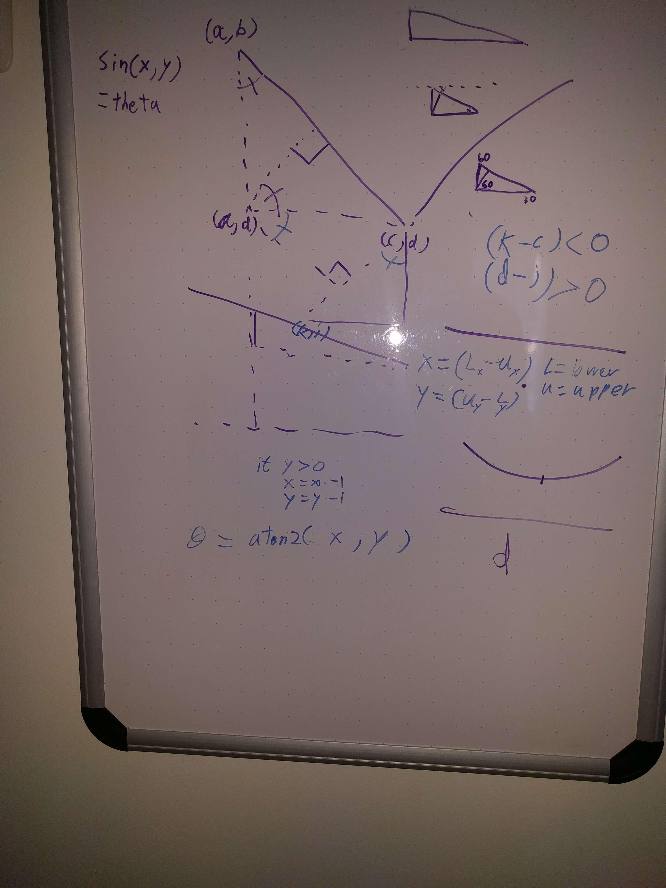
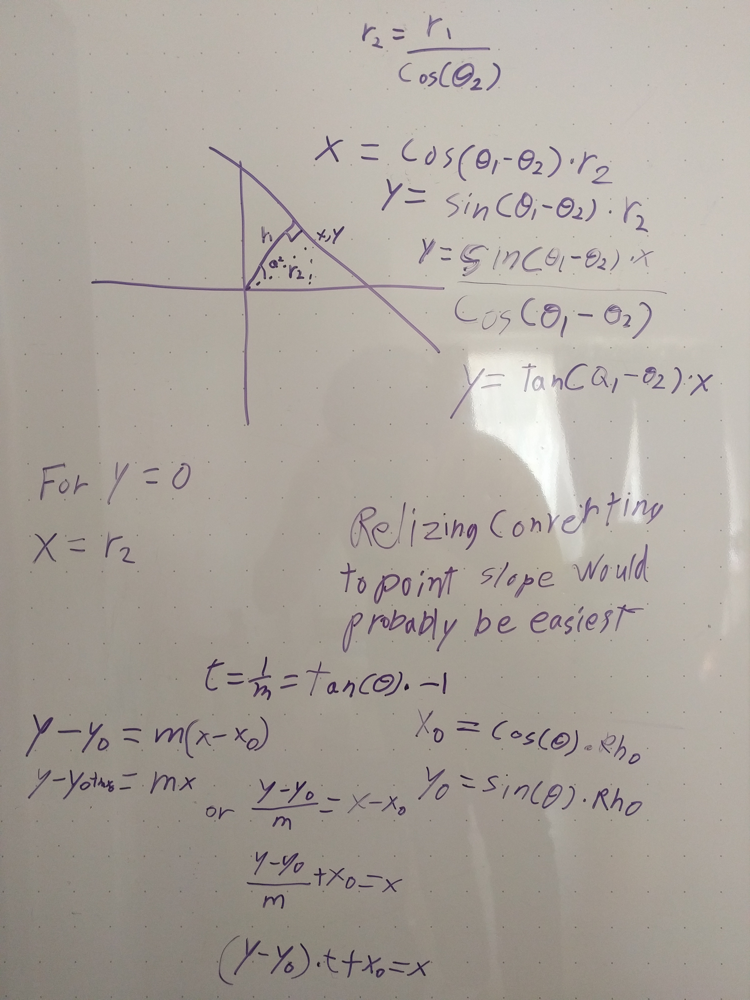

# **Finding Lane Lines on the Road** 

[//]: # (Image References)

[image0]: ./test_images/solidWhiteCurve.jpg
[image1]: ./test_images_output/ROI_solidWhiteCurve.jpg
[image2]: ./test_images_output/filterRoadColor_solidWhiteCurve.jpg
[image3]: ./test_images_output/lanelinessolidWhiteCurve.jpg

---

## Reflection

### 1. Pipeline Description

My pipeline consisted of 4 steps.

First I set all points outside the region of intrest to black. Second I tried to emulate what sebation metioned in the the DARPA grand challenge video. I tried to determine what color the road was and filter out all pixels in that range. Third, I fed the remaining pixels which I surmised should only include lanes into the the OpenCV HoughLinesP function. I then consolidate all the lines output by the HoughLinesP into two lines.

#### Orginal Image:

![alt text][image0]

#### Step1 Example:

![alt text][image1]

#### Step2 Example:

![alt text][image2]

#### Step3 Example:

![alt text][image3]

#### Step3 Details:

So I think I went a bit down the rabbit hole for this part. I thought it would be cool to group the lines in hough space then do an average of their rho and theta to get the desired output line. I thought there would be existing equations to convert a line for cartasian space to hough space. I was unable to find any so I had to figure it out myself. I wrote **_line_to_hough(x1, y1, x2, y2)_** and **_getXforY(y,line)_** to help with converting between the two spaces.

##### White Board Math for line_to_hough(x1, y1, x2, y2)

##### White Board Math for getXforY(y,line)

I used **_line_to_hough(x1, y1, x2, y2)_** to convert the lines into hough space. Once I had the lines in hough space I sperated them by those with a theta of greater than pi/2 and less than pi/2. I then averaged each group to get the aveage left and right line corrisponding to the left and right lane. I then used **_getXforY(y,line)_** to get the corrisponding x value for the top and bottom of my area of interest.

### 2. Identify potential shortcomings with your current pipeline

Cars/other obsitcals will throw it off
Doesn't work well for changing pavement color.
Assumes two lanes
Assumes pavmet color

One potential shortcoming would be what would happen when ... 

Another shortcoming could be ...

### 3. Suggest possible improvements to your pipeline

Some type of line memory so if line jumps to far or disapears use last line.

A possible improvement would be to ...

Another potential improvement could be to ...
